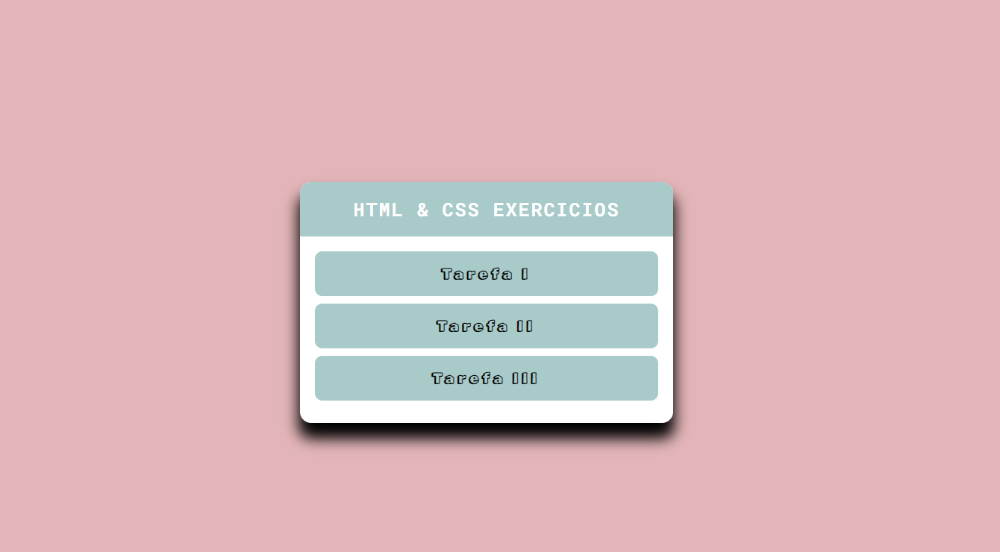

# DevQuest - HTML & CSS ⭐
## Quest - Pagina de exercicios módulos básicos
### [Deploy](https://josuecosta2023.github.io/DevQuest-exercicios-HTML-CSS-Basico/index.html)

# Desafio: Centralizar todos o sexercicios propóstos
## Objetivos:
* Linkar HTMLS E CSS
* Criar lista de itens
* Criar link externo com imagem placeholder
* Costumizar diferentes paragrafos, de modo que quando for inserido novos paragrafos eles irão aproveitar a estilização dos anteriores.

## Maior dificuldade:
* Criar classes reutilizáveis

## O que aprendi?
* Aprendi a importância de linkar corretamente meus arquivos, e a criar classes que podem ser reutilizadas pelo meu sistema em qualquer outro momento.

### Screenshots
* Desktop
** 

# Author
### Josué Ocanha Costa
#### FrontEnd Developer
#### Redes Sociais

# "Vida longa e próspera. 🖖🖖🖖"
